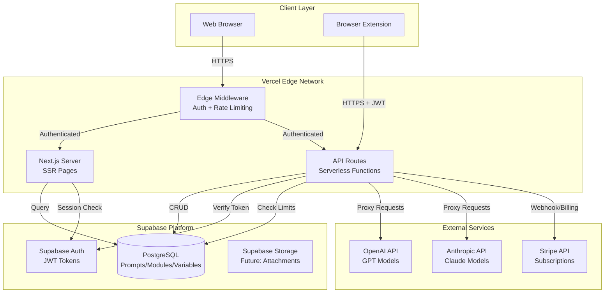
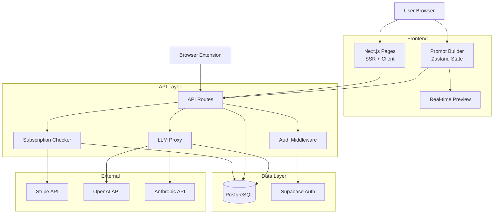

# PromptPal Fullstack Architecture Document

**Version**: 1.0
**Date**: 2025-10-14
**Status**: Draft

---

## Introduction

This document outlines the complete fullstack architecture for **PromptPal**, including backend systems, frontend implementation, and their integration. It serves as the single source of truth for AI-driven development, ensuring consistency across the entire technology stack.

This unified approach combines what would traditionally be separate backend and frontend architecture documents, streamlining the development process for modern fullstack applications where these concerns are increasingly intertwined.

### Starter Template or Existing Project

**Project Type**: Brownfield Enhancement

**Foundation**: Vibin Coders SaaS Accelerator (Next.js 15+ based)

This project is built on an existing, production-ready SaaS accelerator that provides:

- **Complete Authentication System**: Supabase Auth with JWT tokens, login/signup flows, password reset, protected routes (server & client-side), OAuth callback handling
- **Subscription Management**: Full Stripe integration with checkout, webhooks, customer portal, three-tier pricing (Free/Pro/Enterprise)
- **Database Foundation**: Supabase (PostgreSQL) with existing schema for users, subscriptions, products, prices, features
- **UI Framework**: Next.js 15 App Router, TypeScript, Tailwind CSS, shadcn/ui components, dark/light theming
- **Testing Infrastructure**: Playwright E2E testing with auth and subscription test helpers
- **Development Workflow**: ESLint, Prettier, TypeScript strict mode, hot reload with Turbopack

**Architectural Constraints (MUST BE RETAINED)**:

✅ **Keep Existing**:
- Next.js 15+ App Router architecture
- Supabase for auth and database
- Stripe subscription system (extend with PromptPal limits)
- shadcn/ui component patterns
- TypeScript strict mode
- Existing middleware for route protection
- Current project structure (`src/app/`, `src/components/`, `src/lib/`)

🔧 **Extend/Modify**:
- Add new database tables for prompts, modules, variables, folders
- Create new API routes for prompt operations and LLM provider integration
- Add new UI components for prompt builder, module editor, variable forms
- Extend subscription features table with PromptPal-specific limits
- Add new protected routes for library, prompts, execution

❌ **Cannot Change**:
- Authentication system (must use Supabase Auth)
- Payment processing (must use Stripe)
- Core routing patterns (must follow App Router conventions)
- TypeScript as primary language

**Key Documentation References**:
- [CLAUDE.md](../CLAUDE.md) - Comprehensive project documentation
- [docs/prd.md](prd.md) - Complete product requirements
- [INSTALL.md](../INSTALL.md) - Setup and installation guide
- [STRIPE.md](../STRIPE.md) - Payment integration details

### Change Log

| Date | Version | Description | Author |
|------|---------|-------------|--------|
| 2025-10-14 | 1.0 | Initial fullstack architecture document | Winston (Architect) |

---

## High Level Architecture

### Technical Summary

PromptPal implements a **server-rendered Next.js application with progressive enhancement**, deploying on Vercel's edge network with Supabase as the backend-as-a-service platform. The frontend leverages Next.js 15 App Router for server-side rendering of prompt libraries, while interactive components (prompt builder, real-time preview) use client components with React 18. The backend consists of Next.js API routes handling prompt CRUD operations, LLM provider proxying, and browser extension API endpoints, all authenticated via Supabase JWT middleware. Data persistence uses PostgreSQL via Supabase with Row Level Security policies enforcing multi-tenant isolation. The architecture extends the existing SaaS accelerator's Stripe subscription system to enforce PromptPal-specific feature limits (prompt counts, API executions). This hybrid SSR/SPA approach optimizes for initial load performance while maintaining rich interactivity for the prompt builder experience.

### Platform and Infrastructure Choice

**Platform**: Vercel (Edge Network)

**Key Services**:
- Vercel Functions (API routes, LLM proxy)
- Vercel Edge Middleware (auth, rate limiting)
- Supabase Auth (JWT token management)
- Supabase PostgreSQL (prompts, modules, variables, folders)
- Supabase Storage (future: prompt attachments/media)
- Supabase Realtime (future: collaborative editing)
- Vercel KV (Redis) - future caching layer

**Deployment Host and Regions**:
- Primary: Vercel Edge (global CDN with 100+ locations)
- Database: Supabase US-East (can relocate based on user geography)

**Decision Rationale**: Retaining existing Vercel + Supabase infrastructure. This brownfield choice provides zero-config deployment, automatic scaling, integrated preview environments, and strong developer experience. The platform supports all PromptPal requirements without migration risk.

### Repository Structure

**Structure**: Single Next.js application (monolithic)

**Code Organization**: Feature-based within `src/` directory

**Rationale**: Maintains existing brownfield structure without introducing workspace complexity. Business logic in `src/lib/` is independently testable while following Next.js App Router conventions.

**Directory Structure**:

```
main-pal-app/                    # Root (existing)
├── src/                         # Main Next.js application (existing)
│   ├── app/                     # App Router pages & API routes
│   │   ├── api/
│   │   │   ├── prompts/        # Prompt CRUD endpoints (NEW)
│   │   │   ├── modules/        # Module management (NEW)
│   │   │   ├── folders/        # Folder operations (NEW)
│   │   │   └── llm/            # LLM execution (NEW)
│   │   ├── library/            # Prompt library UI (NEW)
│   │   └── prompts/            # Prompt builder & executor UI (NEW)
│   ├── components/              # React components (existing)
│   │   ├── prompts/            # Prompt-specific components (NEW)
│   │   │   ├── PromptCard.tsx
│   │   │   ├── PromptBuilder.tsx
│   │   │   ├── ModuleEditor.tsx
│   │   │   ├── VariableForm.tsx
│   │   │   └── PromptPreview.tsx
│   │   └── folders/            # Folder management (NEW)
│   │       └── FolderTree.tsx
│   ├── lib/                     # Shared utilities & business logic (existing)
│   │   ├── prompts.ts          # Prompt utilities (NEW)
│   │   ├── modules.ts          # Module logic (NEW)
│   │   ├── variables.ts        # Variable substitution engine (NEW)
│   │   └── llm-providers.ts    # LLM API client wrappers (NEW)
│   └── types/                   # TypeScript definitions (existing)
│       ├── prompts.ts          # Prompt types (NEW)
│       ├── modules.ts          # Module types (NEW)
│       └── variables.ts        # Variable types (NEW)
├── supabase/                    # Database layer (NEW)
│   └── migrations/              # SQL migration files
├── tests/                       # E2E tests (existing, extend)
│   ├── prompts/                # Prompt feature tests (NEW)
│   └── utils/                  # Test helpers (existing)
├── docs/                        # Documentation (existing)
│   └── prd/                    # Product requirements (existing)
└── package.json                 # Single package configuration (existing)
```

### High Level Architecture Diagram



### Architectural Patterns

- **Jamstack Architecture:** Static site generation with serverless APIs - _Rationale:_ Optimal for prompt library rendering (static) with dynamic execution (serverless), leverages Vercel's edge caching for fast global access

- **Backend-for-Frontend (BFF):** Next.js API routes proxy LLM provider requests - _Rationale:_ Secures API keys server-side, enables usage tracking, provides consistent error handling across providers

- **Component-Based UI:** Reusable React components with TypeScript - _Rationale:_ Existing shadcn/ui library provides consistent design system, TypeScript ensures type safety across large codebase

- **Repository Pattern:** Abstract data access via lib/prompts.ts, lib/modules.ts - _Rationale:_ Isolates Supabase implementation details, enables testing with mocks, simplifies future database migrations

- **Optimistic UI Updates:** Client updates UI before server confirmation - _Rationale:_ Critical for prompt builder responsiveness (auto-save every 200ms), improves perceived performance

- **Row Level Security (RLS):** PostgreSQL policies enforce user data isolation - _Rationale:_ Supabase best practice, prevents data leaks in multi-tenant architecture, enforces authorization at database level

- **API Gateway Pattern:** Centralized authentication via Next.js middleware - _Rationale:_ Existing pattern in accelerator, applies JWT validation and rate limiting to all API routes consistently

- **Progressive Enhancement:** Server-rendered pages with client-side interactivity - _Rationale:_ Fast initial load for SEO and performance, rich interactions where needed (builder, executor)

---

## Tech Stack

This is the DEFINITIVE technology selection for the entire project. All development must use these exact versions.

### Technology Stack Table

| Category | Technology | Version | Purpose | Rationale |
|----------|-----------|---------|---------|-----------|
| **Frontend Language** | TypeScript | 5.3+ | Type-safe frontend development | Already implemented in accelerator, enforces strict typing, excellent IDE support |
| **Frontend Framework** | Next.js | 15.0+ | React framework with SSR/SSG | Existing foundation, App Router provides optimal routing, built-in API routes, Vercel optimized |
| **UI Component Library** | shadcn/ui | Latest | Component primitives | Already integrated, Radix UI primitives, fully customizable, TypeScript first |
| **State Management** | React Context + Zustand | React 18 / 4.5+ | Global state for prompt builder | Context for auth (existing), Zustand for complex builder state (undo/redo, optimistic updates) |
| **Backend Language** | TypeScript | 5.3+ | Type-safe backend development | Shared types between frontend/backend, same language reduces context switching |
| **Backend Framework** | Next.js API Routes | 15.0+ | Serverless API endpoints | Collocated with frontend, zero-config deployment, automatic TypeScript support |
| **API Style** | REST | - | HTTP endpoints with JSON | Matches existing Stripe/Supabase patterns, simpler than GraphQL for CRUD operations, browser extension compatible |
| **Database** | PostgreSQL (Supabase) | 15+ | Relational data storage | Existing integration, supports complex queries, RLS policies, JSON columns for flexibility |
| **Cache** | Vercel KV (Redis) | - | Query result caching | Future optimization, instant global cache, seamless Vercel integration |
| **File Storage** | Supabase Storage | - | Future: Prompt attachments | Already configured, S3-compatible, RLS policies, CDN integration |
| **Authentication** | Supabase Auth | Latest | User authentication | Existing implementation, JWT tokens, OAuth providers, session management |
| **Frontend Testing** | React Testing Library | 14+ | Component unit tests | Industry standard, promotes accessibility testing, works with Jest |
| **Backend Testing** | Jest | 29+ | API route unit tests | Fast, TypeScript support, mocking capabilities |
| **E2E Testing** | Playwright | 1.40+ | End-to-end workflows | Already implemented, multi-browser support, excellent debugging tools |
| **Build Tool** | Turbopack | Built-in | Fast development builds | Next.js 15 default, 700x faster than Webpack, instant HMR |
| **Bundler** | Next.js bundler | Built-in | Production optimization | Handles code splitting, tree shaking, minification automatically |
| **IaC Tool** | Supabase CLI | Latest | Database migrations | Version-controlled schema changes, rollback support, local development |
| **CI/CD** | GitHub Actions + Vercel | - | Automated testing and deployment | Free for open source, Vercel preview deployments per PR, Playwright CI integration |
| **Monitoring** | Vercel Analytics | - | Performance monitoring | Built-in, Core Web Vitals tracking, zero config |
| **Logging** | Vercel Logs + Supabase Logs | - | Application logging | Centralized logging, query performance insights, error tracking |
| **CSS Framework** | Tailwind CSS | 3.4+ | Utility-first styling | Already configured, mobile-first responsive, dark mode support, JIT compilation |

### Additional Key Dependencies

| Category | Technology | Version | Purpose | Rationale |
|----------|-----------|---------|---------|-----------|
| **Rich Text Editor** | Tiptap | 2.1+ | Module content editing | Markdown-compatible, variable insertion support, extensible, headless |
| **Drag & Drop** | dnd-kit | 6.1+ | Module reordering | Accessibility first, touch support, performant, TypeScript native |
| **Form Validation** | Zod | 3.22+ | Schema validation | TypeScript-first, runtime validation, shared across client/server |
| **HTTP Client** | Native fetch | Built-in | API requests | Edge runtime compatible, no external dependency, modern async/await |
| **Date Handling** | date-fns | 3.0+ | Date formatting | Lightweight, tree-shakeable, simpler than Moment.js |
| **Icons** | Lucide React | 0.300+ | Icon library | Already used, consistent design, optimized SVGs, extensive collection |
| **Markdown** | remark + rehype | Latest | Markdown processing | Module option rendering, variable highlighting, sanitization |
| **API Key Encryption** | Node crypto | Built-in | AES-256 encryption | No external deps, FIPS compliant, secure key storage |
| **LLM SDKs** | OpenAI SDK, Anthropic SDK | Latest | Provider integrations | Official SDKs, type-safe, streaming support, error handling |
| **Rate Limiting** | @upstash/ratelimit | Latest | API protection | Vercel KV integration, distributed rate limiting, per-user limits |

---

## Data Models

Define the core data models/entities that will be shared between frontend and backend.

### User (Existing)

**Purpose**: Represents authenticated users of the PromptPal application. This model already exists in the Supabase Auth system and should not be modified.

**Key Attributes**:
- `id`: UUID - Primary key, automatically generated by Supabase Auth
- `email`: string - User's email address (unique)
- `created_at`: timestamp - Account creation timestamp
- `metadata`: JSONB - Additional user profile data

#### TypeScript Interface

```typescript
// Extends Supabase Auth User type (existing)
import { User as SupabaseUser } from '@supabase/supabase-js';

export type User = SupabaseUser;

// Custom user profile (optional extension)
export interface UserProfile {
  id: string;
  display_name?: string;
  avatar_url?: string;
  preferences?: {
    theme: 'light' | 'dark';
    default_llm_provider?: string;
  };
}
```

#### Relationships

- Has many: Prompts, Folders, EncryptedApiKeys, UsageTracking records

---

### Folder

**Purpose**: Organizes prompts into flat folder structure (no nesting). Enables categorization and filtering of prompt libraries.

**Key Attributes**:
- `id`: UUID - Primary key
- `user_id`: UUID - Foreign key to auth.users
- `name`: string (max 255 chars) - Folder display name
- `created_at`: timestamp - Creation timestamp
- `updated_at`: timestamp - Last modification timestamp
- `deleted_at`: timestamp (nullable) - Soft delete timestamp

#### TypeScript Interface

```typescript
export interface Folder {
  id: string;
  user_id: string;
  name: string;
  created_at: string;
  updated_at: string;
  deleted_at: string | null;
}

// With computed properties for UI
export interface FolderWithCount extends Folder {
  prompt_count: number;
}

// For creation/updates
export interface FolderInput {
  name: string;
}
```

#### Relationships

- Belongs to: User
- Has many: Prompts

---

### Prompt

**Purpose**: Core entity representing a complete prompt with modular structure, variables, and metadata.

**Key Attributes**:
- `id`: UUID - Primary key
- `user_id`: UUID - Foreign key to auth.users
- `folder_id`: UUID (nullable) - Foreign key to folders (null = uncategorized)
- `name`: string (max 255 chars) - Prompt display name
- `description`: text (nullable) - Optional prompt description
- `created_at`: timestamp - Creation timestamp
- `updated_at`: timestamp - Last modification timestamp (updated on module/variable changes)
- `deleted_at`: timestamp (nullable) - Soft delete timestamp

#### TypeScript Interface

```typescript
export interface Prompt {
  id: string;
  user_id: string;
  folder_id: string | null;
  name: string;
  description: string | null;
  created_at: string;
  updated_at: string;
  deleted_at: string | null;
}

// With related data for UI
export interface PromptWithDetails extends Prompt {
  folder?: Folder;
  modules: ModuleWithOptions[];
  variables: Variable[];
  module_count: number;
  variable_count: number;
}

// For creation/updates
export interface PromptInput {
  name: string;
  description?: string;
  folder_id?: string | null;
}
```

#### Relationships

- Belongs to: User, Folder (optional)
- Has many: Modules, Variables, UsageTracking records

---

### Module

**Purpose**: Named section within a prompt (e.g., "Context", "Goal", "Persona"). Each module has multiple options allowing runtime selection.

**Key Attributes**:
- `id`: UUID - Primary key
- `prompt_id`: UUID - Foreign key to prompts
- `name`: string (max 255 chars) - Module display name
- `order_index`: integer - Position in prompt (0-based, allows reordering)
- `visible`: boolean - Whether module is enabled (allows temporary disable)
- `created_at`: timestamp - Creation timestamp
- `updated_at`: timestamp - Last modification timestamp

#### TypeScript Interface

```typescript
export interface Module {
  id: string;
  prompt_id: string;
  name: string;
  order_index: number;
  visible: boolean;
  created_at: string;
  updated_at: string;
}

// With options for full module data
export interface ModuleWithOptions extends Module {
  options: ModuleOption[];
  default_option_id?: string;
}

// For creation/updates
export interface ModuleInput {
  name: string;
  order_index: number;
  visible?: boolean;
}

// For bulk reordering
export interface ModuleReorderInput {
  id: string;
  order_index: number;
}
```

#### Relationships

- Belongs to: Prompt
- Has many: ModuleOptions

---

### ModuleOption

**Purpose**: Alternative content variations for a module. User selects one option per module during execution.

**Key Attributes**:
- `id`: UUID - Primary key
- `module_id`: UUID - Foreign key to modules
- `content`: text - Option content (supports markdown, variables via `{var_name}`)
- `is_default`: boolean - Whether this is the default selected option
- `metadata`: JSONB (nullable) - Optional metadata (tags, version info)
- `created_at`: timestamp - Creation timestamp
- `updated_at`: timestamp - Last modification timestamp

#### TypeScript Interface

```typescript
export interface ModuleOption {
  id: string;
  module_id: string;
  content: string;
  is_default: boolean;
  metadata: Record<string, unknown> | null;
  created_at: string;
  updated_at: string;
}

// For creation/updates
export interface ModuleOptionInput {
  content: string;
  is_default?: boolean;
  metadata?: Record<string, unknown>;
}

// For preview rendering
export interface RenderedModuleOption extends ModuleOption {
  rendered_content: string; // After variable substitution
  variables_used: string[]; // List of {var_name} references
}
```

#### Relationships

- Belongs to: Module

---

### Variable

**Purpose**: Defines placeholder variables in module options with type information and validation rules.

**Key Attributes**:
- `id`: UUID - Primary key
- `prompt_id`: UUID - Foreign key to prompts
- `name`: string (max 255 chars) - Variable name (used as `{name}` in content)
- `type`: string - Variable type (text, number, date, select, multiline)
- `config`: JSONB - Type-specific configuration (validation rules, default values, options)
- `created_at`: timestamp - Creation timestamp
- `updated_at`: timestamp - Last modification timestamp

#### TypeScript Interface

```typescript
export type VariableType = 'text' | 'number' | 'date' | 'select' | 'multiline';

export interface VariableConfig {
  required?: boolean;
  default_value?: string | number;
  min_length?: number; // For text/multiline
  max_length?: number; // For text/multiline
  min_value?: number;  // For number
  max_value?: number;  // For number
  regex_pattern?: string; // For text validation
  select_options?: string[]; // For select type
  placeholder?: string;
  help_text?: string;
}

export interface Variable {
  id: string;
  prompt_id: string;
  name: string;
  type: VariableType;
  config: VariableConfig;
  created_at: string;
  updated_at: string;
}

// For creation/updates
export interface VariableInput {
  name: string;
  type: VariableType;
  config?: VariableConfig;
}

// For runtime substitution
export interface VariableValue {
  name: string;
  value: string | number;
}
```

#### Relationships

- Belongs to: Prompt

---

### EncryptedApiKey

**Purpose**: Securely stores LLM provider API keys with AES-256 encryption. Enables user-specific API key management.

**Key Attributes**:
- `id`: UUID - Primary key
- `user_id`: UUID - Foreign key to auth.users
- `provider`: string (max 50 chars) - Provider identifier (openai, anthropic)
- `nickname`: string (max 255 chars, nullable) - User-defined nickname
- `encrypted_key`: text - AES-256 encrypted API key
- `last_used_at`: timestamp (nullable) - Last execution timestamp
- `created_at`: timestamp - Creation timestamp
- `revoked_at`: timestamp (nullable) - Revocation timestamp (soft delete)

#### TypeScript Interface

```typescript
export type LLMProvider = 'openai' | 'anthropic';

export interface EncryptedApiKey {
  id: string;
  user_id: string;
  provider: LLMProvider;
  nickname: string | null;
  encrypted_key: string;
  last_used_at: string | null;
  created_at: string;
  revoked_at: string | null;
}

// For creation (plaintext key never stored in DB)
export interface ApiKeyInput {
  provider: LLMProvider;
  plaintext_key: string;
  nickname?: string;
}

// For display (never include encrypted_key)
export interface ApiKeyDisplay {
  id: string;
  provider: LLMProvider;
  nickname: string | null;
  key_preview: string; // e.g., "sk-...abc123" (first 3 + last 6)
  last_used_at: string | null;
  created_at: string;
  is_revoked: boolean;
}
```

#### Relationships

- Belongs to: User

---

### UsageTracking

**Purpose**: Tracks API executions, prompt usage, and user actions for subscription limit enforcement and analytics.

**Key Attributes**:
- `id`: UUID - Primary key
- `user_id`: UUID - Foreign key to auth.users
- `prompt_id`: UUID (nullable) - Foreign key to prompts
- `action`: string (max 50 chars) - Action type (execute_prompt, api_call, export, etc.)
- `metadata`: JSONB (nullable) - Additional context (provider, token count, error info)
- `created_at`: timestamp - Action timestamp

#### TypeScript Interface

```typescript
export type UsageAction =
  | 'execute_prompt'
  | 'api_call_openai'
  | 'api_call_anthropic'
  | 'export_prompts'
  | 'import_prompts'
  | 'extension_sync';

export interface UsageMetadata {
  provider?: LLMProvider;
  model?: string;
  tokens_used?: number;
  success?: boolean;
  error_message?: string;
  export_count?: number;
  import_count?: number;
}

export interface UsageTracking {
  id: string;
  user_id: string;
  prompt_id: string | null;
  action: UsageAction;
  metadata: UsageMetadata | null;
  created_at: string;
}

// For analytics queries
export interface UsageStats {
  user_id: string;
  period: 'day' | 'month';
  action: UsageAction;
  count: number;
  period_start: string;
}
```

#### Relationships

- Belongs to: User, Prompt (optional)

---

## API Specification

The PromptPal API follows REST principles with JSON request/response format. All endpoints require Supabase JWT authentication via Bearer token in Authorization header.

### Base URL
- **Production**: `https://promptpal.vercel.app/api`
- **Development**: `http://localhost:3000/api`

### Authentication
All API routes (except public endpoints) require JWT authentication handled by Next.js middleware. Token obtained from Supabase Auth on login.

### Key API Endpoints

#### Prompts API
- `GET /api/prompts` - List prompts (pagination, filtering, search)
- `POST /api/prompts` - Create prompt (requires subscription limit check)
- `GET /api/prompts/[id]` - Get prompt with modules and variables
- `PATCH /api/prompts/[id]` - Update prompt metadata
- `DELETE /api/prompts/[id]` - Soft delete prompt
- `POST /api/prompts/[id]/duplicate` - Duplicate prompt

#### Folders API
- `GET /api/folders` - List folders with prompt counts
- `POST /api/folders` - Create folder (requires subscription limit check)
- `PATCH /api/folders/[id]` - Rename folder
- `DELETE /api/folders/[id]` - Delete folder (cascade or move prompts)

#### Modules API
- `POST /api/prompts/[promptId]/modules` - Add module
- `PATCH /api/modules/[id]` - Update module name/visibility
- `DELETE /api/modules/[id]` - Delete module (cascades to options)
- `POST /api/modules/reorder` - Bulk reorder modules atomically

#### Variables API
- `GET /api/prompts/[promptId]/variables` - List variables
- `PATCH /api/variables/[id]` - Update variable config

#### Execution API
- `POST /api/prompts/execute` - Execute prompt with LLM (server-side proxy)
  - Body: `{ prompt_id, provider, model, module_selections, variable_values }`
  - Tracks usage for subscription limits
  - Returns: `{ response, usage: { tokens, model } }`

#### Extension API
- `POST /api/extension/auth` - Validate extension JWT
- `GET /api/extension/prompts` - Full library sync
- `GET /api/extension/prompts/sync?since=<timestamp>` - Incremental sync

#### API Keys API (Existing pattern extended)
- `POST /api/api-keys` - Store encrypted LLM provider key
- `GET /api/api-keys` - List user's configured providers
- `DELETE /api/api-keys/[id]` - Revoke API key

### Error Response Format

All errors follow consistent structure:

```json
{
  "error": {
    "code": "SUBSCRIPTION_LIMIT_EXCEEDED",
    "message": "Free tier limited to 100 prompts. Upgrade to Pro for 1000 prompts.",
    "details": {
      "current_count": 100,
      "limit": 100,
      "tier": "free"
    }
  }
}
```

### Common Error Codes
- `UNAUTHORIZED` - Missing or invalid JWT token
- `FORBIDDEN` - Insufficient permissions
- `SUBSCRIPTION_LIMIT_EXCEEDED` - Tier limit reached
- `RESOURCE_NOT_FOUND` - Entity doesn't exist
- `VALIDATION_ERROR` - Invalid request data
- `RATE_LIMIT_EXCEEDED` - Too many requests

### Rate Limiting
- **Authenticated users**: 100 requests/minute
- **LLM execution**: Per subscription tier (Free: 10/day, Pro: 100/day, Enterprise: 1000/day)
- **Extension API**: 30 requests/minute

### Pagination
List endpoints support pagination via query parameters:
- `page` (default: 1)
- `limit` (default: 50, max: 100)

Response includes pagination metadata:
```json
{
  "items": [...],
  "pagination": {
    "page": 1,
    "limit": 50,
    "total": 237,
    "pages": 5
  }
}
```

### Subscription Limit Enforcement
API routes check limits before creation operations:
```typescript
// Example: POST /api/prompts handler
const canCreate = await hasFeatureAccess(userId, 'max_prompts', currentCount + 1);
if (!canCreate) {
  return res.status(403).json({
    error: {
      code: 'SUBSCRIPTION_LIMIT_EXCEEDED',
      message: 'Upgrade to create more prompts'
    }
  });
}
```

---

## Components

Major logical components/services across the fullstack architecture.

### Frontend Application (Next.js)
**Responsibility**: Server-rendered pages, client components, UI layer

**Key Interfaces**:
- Server Components: Library list, prompt detail pages (SSR for SEO/performance)
- Client Components: Prompt builder, variable editor, real-time preview
- API Client: Fetch wrapper with auth token injection

**Dependencies**: Supabase Auth (session), API routes, shadcn/ui components

**Technology Stack**: Next.js 15 App Router, React 18 Server/Client Components, Tailwind CSS, Zustand (builder state)

---

### API Layer (Next.js API Routes)
**Responsibility**: Business logic, authentication, subscription enforcement, LLM proxying

**Key Interfaces**:
- REST endpoints (`/api/prompts/*`, `/api/folders/*`, `/api/modules/*`)
- Middleware: JWT validation, rate limiting, error handling
- Service functions: `lib/prompts.ts`, `lib/modules.ts`, `lib/variables.ts`

**Dependencies**: Supabase client (database), Stripe API (subscription checks), LLM provider SDKs

**Technology Stack**: Next.js API Routes (serverless), Zod validation, @upstash/ratelimit

---

### Database Layer (Supabase PostgreSQL)
**Responsibility**: Data persistence, Row Level Security, full-text search

**Key Interfaces**:
- Tables: prompts, folders, modules, module_options, variables, encrypted_api_keys, usage_tracking
- RLS Policies: User-based isolation (`user_id = auth.uid()`)
- Indexes: `user_id`, `created_at`, `folder_id`, full-text search columns

**Dependencies**: None (foundational layer)

**Technology Stack**: PostgreSQL 15+, Supabase RLS, JSONB columns for flexible schemas

---

### Authentication Service (Supabase Auth)
**Responsibility**: User authentication, JWT token issuance, session management

**Key Interfaces**:
- Sign up/login endpoints (existing)
- OAuth providers (existing)
- JWT token verification for API routes

**Dependencies**: User table (auth.users)

**Technology Stack**: Supabase Auth, JWT tokens, HTTP-only cookies

---

### Subscription Manager (Stripe Integration)
**Responsibility**: Feature access control, usage limit enforcement

**Key Interfaces**:
- `hasFeatureAccess(userId, feature, limit)` - Check subscription limits
- Webhook handlers: subscription updates, payment events
- Customer portal: Plan management

**Dependencies**: Supabase (subscriptions, features tables), Stripe API

**Technology Stack**: Stripe SDK, existing subscription utilities

---

### LLM Proxy Service (API Route)
**Responsibility**: Secure LLM provider API calls, usage tracking, error handling

**Key Interfaces**:
- `POST /api/prompts/execute` - Execute prompt with provider
- Provider adapters: OpenAI, Anthropic clients
- Encryption service: Decrypt API keys at runtime

**Dependencies**: encrypted_api_keys table, LLM provider SDKs, usage_tracking table

**Technology Stack**: OpenAI SDK, Anthropic SDK, Node crypto (AES-256-GCM)

---

### Prompt Engine (Shared Package)
**Responsibility**: Variable substitution, validation, prompt assembly

**Key Interfaces**:
- `assemblePrompt(modules, selections, variables)` - Build final prompt
- `validateVariables(values, config)` - Validate variable inputs
- `extractVariables(content)` - Parse `{var_name}` from content

**Dependencies**: None (pure functions)

**Technology Stack**: TypeScript, Zod validation schemas

**Location**: `packages/prompt-engine/` (new package)

---

### Browser Extension API (Specialized Endpoints)
**Responsibility**: Sync prompt library to browser extension, handle extension auth

**Key Interfaces**:
- `/api/extension/auth` - Validate extension token
- `/api/extension/prompts` - Full sync
- `/api/extension/prompts/sync` - Incremental updates

**Dependencies**: Prompts API, JWT validation

**Technology Stack**: Next.js API routes, incremental sync logic

---

### Component Interaction Diagram



---

## Database Schema

Complete PostgreSQL schema for PromptPal (extends existing Supabase schema).

### New Tables

```sql
-- Enable UUID extension
CREATE EXTENSION IF NOT EXISTS "uuid-ossp";

-- Folders table
CREATE TABLE folders (
  id UUID PRIMARY KEY DEFAULT uuid_generate_v4(),
  user_id UUID NOT NULL REFERENCES auth.users(id) ON DELETE CASCADE,
  name VARCHAR(255) NOT NULL,
  created_at TIMESTAMP WITH TIME ZONE DEFAULT NOW(),
  updated_at TIMESTAMP WITH TIME ZONE DEFAULT NOW(),
  deleted_at TIMESTAMP WITH TIME ZONE,
  UNIQUE(user_id, name),
  CONSTRAINT valid_folder_name CHECK (LENGTH(name) >= 1)
);

-- Prompts table
CREATE TABLE prompts (
  id UUID PRIMARY KEY DEFAULT uuid_generate_v4(),
  user_id UUID NOT NULL REFERENCES auth.users(id) ON DELETE CASCADE,
  folder_id UUID REFERENCES folders(id) ON DELETE SET NULL,
  name VARCHAR(255) NOT NULL,
  description TEXT,
  created_at TIMESTAMP WITH TIME ZONE DEFAULT NOW(),
  updated_at TIMESTAMP WITH TIME ZONE DEFAULT NOW(),
  deleted_at TIMESTAMP WITH TIME ZONE,
  CONSTRAINT valid_prompt_name CHECK (LENGTH(name) >= 1)
);

-- Modules table
CREATE TABLE modules (
  id UUID PRIMARY KEY DEFAULT uuid_generate_v4(),
  prompt_id UUID NOT NULL REFERENCES prompts(id) ON DELETE CASCADE,
  name VARCHAR(255) NOT NULL,
  order_index INTEGER NOT NULL,
  visible BOOLEAN DEFAULT TRUE,
  created_at TIMESTAMP WITH TIME ZONE DEFAULT NOW(),
  updated_at TIMESTAMP WITH TIME ZONE DEFAULT NOW(),
  CONSTRAINT valid_order CHECK (order_index >= 0)
);

-- Module options table
CREATE TABLE module_options (
  id UUID PRIMARY KEY DEFAULT uuid_generate_v4(),
  module_id UUID NOT NULL REFERENCES modules(id) ON DELETE CASCADE,
  content TEXT NOT NULL,
  is_default BOOLEAN DEFAULT FALSE,
  metadata JSONB,
  created_at TIMESTAMP WITH TIME ZONE DEFAULT NOW(),
  updated_at TIMESTAMP WITH TIME ZONE DEFAULT NOW(),
  CONSTRAINT valid_content CHECK (LENGTH(content) >= 1)
);

-- Variables table
CREATE TABLE variables (
  id UUID PRIMARY KEY DEFAULT uuid_generate_v4(),
  prompt_id UUID NOT NULL REFERENCES prompts(id) ON DELETE CASCADE,
  name VARCHAR(255) NOT NULL,
  type VARCHAR(50) DEFAULT 'text',
  config JSONB,
  created_at TIMESTAMP WITH TIME ZONE DEFAULT NOW(),
  updated_at TIMESTAMP WITH TIME ZONE DEFAULT NOW(),
  UNIQUE(prompt_id, name),
  CONSTRAINT valid_var_name CHECK (name ~ '^[a-zA-Z0-9_]+$'),
  CONSTRAINT valid_var_type CHECK (type IN ('text', 'number', 'date', 'select', 'multiline'))
);

-- Encrypted API keys table
CREATE TABLE encrypted_api_keys (
  id UUID PRIMARY KEY DEFAULT uuid_generate_v4(),
  user_id UUID NOT NULL REFERENCES auth.users(id) ON DELETE CASCADE,
  provider VARCHAR(50) NOT NULL,
  nickname VARCHAR(255),
  encrypted_key TEXT NOT NULL,
  last_used_at TIMESTAMP WITH TIME ZONE,
  created_at TIMESTAMP WITH TIME ZONE DEFAULT NOW(),
  revoked_at TIMESTAMP WITH TIME ZONE,
  CONSTRAINT valid_provider CHECK (provider IN ('openai', 'anthropic'))
);

-- Usage tracking table
CREATE TABLE usage_tracking (
  id UUID PRIMARY KEY DEFAULT uuid_generate_v4(),
  user_id UUID NOT NULL REFERENCES auth.users(id) ON DELETE CASCADE,
  prompt_id UUID REFERENCES prompts(id) ON DELETE SET NULL,
  action VARCHAR(50) NOT NULL,
  metadata JSONB,
  created_at TIMESTAMP WITH TIME ZONE DEFAULT NOW()
);

-- Indexes for performance
CREATE INDEX idx_folders_user_id ON folders(user_id) WHERE deleted_at IS NULL;
CREATE INDEX idx_prompts_user_id ON prompts(user_id) WHERE deleted_at IS NULL;
CREATE INDEX idx_prompts_folder_id ON prompts(folder_id) WHERE deleted_at IS NULL;
CREATE INDEX idx_prompts_updated_at ON prompts(updated_at DESC) WHERE deleted_at IS NULL;
CREATE INDEX idx_modules_prompt_id ON modules(prompt_id);
CREATE INDEX idx_modules_order ON modules(prompt_id, order_index);
CREATE INDEX idx_module_options_module_id ON module_options(module_id);
CREATE INDEX idx_variables_prompt_id ON variables(prompt_id);
CREATE INDEX idx_api_keys_user_id ON encrypted_api_keys(user_id) WHERE revoked_at IS NULL;
CREATE INDEX idx_usage_tracking_user_id ON usage_tracking(user_id, created_at DESC);
CREATE INDEX idx_usage_tracking_action ON usage_tracking(user_id, action, created_at DESC);

-- Row Level Security Policies
ALTER TABLE folders ENABLE ROW LEVEL SECURITY;
ALTER TABLE prompts ENABLE ROW LEVEL SECURITY;
ALTER TABLE modules ENABLE ROW LEVEL SECURITY;
ALTER TABLE module_options ENABLE ROW LEVEL SECURITY;
ALTER TABLE variables ENABLE ROW LEVEL SECURITY;
ALTER TABLE encrypted_api_keys ENABLE ROW LEVEL SECURITY;
ALTER TABLE usage_tracking ENABLE ROW LEVEL SECURITY;

-- Folders policies
CREATE POLICY "Users can view own folders" ON folders FOR SELECT USING (auth.uid() = user_id);
CREATE POLICY "Users can create own folders" ON folders FOR INSERT WITH CHECK (auth.uid() = user_id);
CREATE POLICY "Users can update own folders" ON folders FOR UPDATE USING (auth.uid() = user_id);
CREATE POLICY "Users can delete own folders" ON folders FOR DELETE USING (auth.uid() = user_id);

-- Prompts policies
CREATE POLICY "Users can view own prompts" ON prompts FOR SELECT USING (auth.uid() = user_id);
CREATE POLICY "Users can create own prompts" ON prompts FOR INSERT WITH CHECK (auth.uid() = user_id);
CREATE POLICY "Users can update own prompts" ON prompts FOR UPDATE USING (auth.uid() = user_id);
CREATE POLICY "Users can delete own prompts" ON prompts FOR DELETE USING (auth.uid() = user_id);

-- Modules policies (via prompts)
CREATE POLICY "Users can view own modules" ON modules FOR SELECT
  USING (EXISTS (SELECT 1 FROM prompts WHERE prompts.id = modules.prompt_id AND prompts.user_id = auth.uid()));
CREATE POLICY "Users can create own modules" ON modules FOR INSERT
  WITH CHECK (EXISTS (SELECT 1 FROM prompts WHERE prompts.id = modules.prompt_id AND prompts.user_id = auth.uid()));
CREATE POLICY "Users can update own modules" ON modules FOR UPDATE
  USING (EXISTS (SELECT 1 FROM prompts WHERE prompts.id = modules.prompt_id AND prompts.user_id = auth.uid()));
CREATE POLICY "Users can delete own modules" ON modules FOR DELETE
  USING (EXISTS (SELECT 1 FROM prompts WHERE prompts.id = modules.prompt_id AND prompts.user_id = auth.uid()));

-- Similar policies for module_options, variables (omitted for brevity - follow same pattern)

-- API keys policies
CREATE POLICY "Users can view own API keys" ON encrypted_api_keys FOR SELECT USING (auth.uid() = user_id);
CREATE POLICY "Users can create own API keys" ON encrypted_api_keys FOR INSERT WITH CHECK (auth.uid() = user_id);
CREATE POLICY "Users can update own API keys" ON encrypted_api_keys FOR UPDATE USING (auth.uid() = user_id);
CREATE POLICY "Users can delete own API keys" ON encrypted_api_keys FOR DELETE USING (auth.uid() = user_id);

-- Usage tracking policies
CREATE POLICY "Users can view own usage" ON usage_tracking FOR SELECT USING (auth.uid() = user_id);
CREATE POLICY "System can insert usage" ON usage_tracking FOR INSERT WITH CHECK (true);

-- Updated_at trigger function
CREATE OR REPLACE FUNCTION update_updated_at_column()
RETURNS TRIGGER AS $$
BEGIN
  NEW.updated_at = NOW();
  RETURN NEW;
END;
$$ LANGUAGE plpgsql;

-- Apply triggers
CREATE TRIGGER update_folders_updated_at BEFORE UPDATE ON folders
  FOR EACH ROW EXECUTE FUNCTION update_updated_at_column();
CREATE TRIGGER update_prompts_updated_at BEFORE UPDATE ON prompts
  FOR EACH ROW EXECUTE FUNCTION update_updated_at_column();
CREATE TRIGGER update_modules_updated_at BEFORE UPDATE ON modules
  FOR EACH ROW EXECUTE FUNCTION update_updated_at_column();
CREATE TRIGGER update_module_options_updated_at BEFORE UPDATE ON module_options
  FOR EACH ROW EXECUTE FUNCTION update_updated_at_column();
CREATE TRIGGER update_variables_updated_at BEFORE UPDATE ON variables
  FOR EACH ROW EXECUTE FUNCTION update_updated_at_column();
```

### Migration Workflow

**Prerequisites:**
```bash
npm install -g supabase  # Install Supabase CLI
supabase link --project-ref <your-project-ref>  # Link to your project
```

**Creating the Initial Migration:**
```bash
# Create timestamped migration file
supabase migration new create_prompts_schema

# Copy the complete schema above (lines 952-1117) into:
# supabase/migrations/YYYYMMDDHHMMSS_create_prompts_schema.sql

# Test locally
supabase db reset  # Resets local DB and applies all migrations

# Generate TypeScript types
supabase gen types typescript --local > src/types/database.ts
```

**Development Workflow:**
```bash
# 1. Make schema changes in new migration file
supabase migration new add_feature_name

# 2. Write migration SQL
# Edit: supabase/migrations/YYYYMMDDHHMMSS_add_feature_name.sql

# 3. Test locally
supabase db reset

# 4. Regenerate types
supabase gen types typescript --local > src/types/database.ts

# 5. Commit migration to git
git add supabase/migrations/ src/types/database.ts
git commit -m "feat: add feature_name schema"
```

**Deploying to Production:**
```bash
# Push migrations to remote Supabase
supabase db push

# Verify in Supabase Dashboard
# Check: Database > Migrations tab
```

**Schema Drift Prevention:**
1. **Never** manually edit database via Supabase Dashboard SQL editor
2. **Always** create migrations for schema changes
3. **Commit** migrations to git before deploying
4. **Regenerate** TypeScript types after each migration
5. **Test** migrations locally before pushing to production

**Migration Naming Convention:**
- `YYYYMMDDHHMMSS_create_prompts_schema.sql` - Initial schema
- `YYYYMMDDHHMMSS_add_folders_table.sql` - Add new table
- `YYYYMMDDHHMMSS_add_prompt_search_index.sql` - Performance optimization
- `YYYYMMDDHHMMSS_update_rls_policies.sql` - Security updates

### Existing Tables (Retain)
- `auth.users` - Supabase Auth users
- `subscriptions` - User subscription records
- `products` - Subscription plans
- `prices` - Plan pricing
- `features` - Feature limits per plan

---

## Complete Project Structure

Full Next.js application structure showing existing foundation and new PromptPal features.

```
main-pal-app/
├── .github/                          # CI/CD workflows
│   └── workflows/
│       ├── ci.yaml                   # Playwright tests, linting
│       └── deploy.yaml               # Vercel deployment
├── src/                              # Main Next.js application (EXISTING)
│   ├── app/                          # App Router pages & API routes
│   │   ├── (marketing)/              # Public pages group
│   │   │   └── page.tsx              # Landing page (existing)
│   │   ├── auth/                     # Auth pages (existing)
│   │   ├── dashboard/                # Dashboard (existing)
│   │   ├── subscriptions/            # Subscription management (existing)
│   │   ├── library/                  # NEW: Prompt library view
│   │   │   └── page.tsx
│   │   ├── prompts/                  # NEW: Prompt management
│   │   │   └── [id]/
│   │   │       ├── edit/page.tsx     # Prompt builder
│   │   │       └── execute/page.tsx  # Prompt executor
│   │   ├── settings/                 # NEW: Extended settings
│   │   │   └── api-keys/page.tsx
│   │   └── api/                      # API routes
│   │       ├── plans/                # Existing
│   │       ├── subscriptions/        # Existing
│   │       ├── prompts/              # NEW: Prompt CRUD
│   │       ├── folders/              # NEW: Folder operations
│   │       ├── modules/              # NEW: Module management
│   │       ├── variables/            # NEW: Variable management
│   │       ├── api-keys/             # NEW: API key encryption
│   │       └── extension/            # NEW: Extension API
│   ├── components/                   # React components
│   │   ├── ui/                       # shadcn/ui (existing)
│   │   ├── auth/                     # Auth components (existing)
│   │   ├── layout/                   # Layout components (existing)
│   │   ├── prompts/                  # NEW: Prompt components
│   │   │   ├── PromptCard.tsx
│   │   │   ├── PromptBuilder.tsx
│   │   │   ├── ModuleEditor.tsx
│   │   │   ├── VariableForm.tsx
│   │   │   └── PromptPreview.tsx
│   │   └── folders/                  # NEW: Folder components
│   │       └── FolderTree.tsx
│   ├── lib/                          # Utility libraries
│   │   ├── auth/                     # Auth utilities (existing)
│   │   ├── supabase/                 # Supabase clients (existing)
│   │   ├── subscriptions.ts          # Subscription utils (existing)
│   │   ├── prompts.ts                # NEW: Prompt operations
│   │   ├── modules.ts                # NEW: Module operations
│   │   ├── variables.ts              # NEW: Variable substitution
│   │   ├── llm-providers.ts          # NEW: LLM client wrappers
│   │   └── encryption.ts             # NEW: API key encryption
│   ├── types/                        # TypeScript definitions
│   │   ├── auth.ts                   # Existing
│   │   ├── subscription.ts           # Existing
│   │   ├── prompts.ts                # NEW
│   │   ├── modules.ts                # NEW
│   │   └── variables.ts              # NEW
│   └── middleware.ts                 # Route protection (existing)
├── supabase/                         # NEW: Database migrations
│   └── migrations/
│       ├── 20250101000000_create_prompts_schema.sql
│       └── 20250101000001_create_rls_policies.sql
├── tests/                            # Playwright E2E tests (existing, extend)
│   ├── utils/
│   │   ├── auth-helpers.ts           # Existing
│   │   └── prompt-helpers.ts         # NEW
│   ├── subscription/                 # Existing tests
│   └── prompts/                      # NEW: Prompt feature tests
│       ├── prompt-crud.spec.ts
│       └── prompt-builder.spec.ts
├── docs/                             # Documentation
│   ├── prd.md                        # Product requirements
│   ├── architecture.md               # THIS DOCUMENT
│   └── api/                          # API documentation
├── .env.local.example                # Environment template (extend)
├── package.json                      # Root package with workspaces
├── tsconfig.json                     # TypeScript configuration
├── tailwind.config.ts                # Tailwind configuration (existing)
├── next.config.ts                    # Next.js configuration (existing)
└── README.md                         # Project documentation
```

### Package.json Scripts

Complete npm scripts available in `package.json`:

```json
{
  "scripts": {
    "dev": "next dev --turbopack",        // Start development server
    "build": "next build",                // Build for production
    "start": "next start",                // Start production server
    "lint": "next lint",                  // Run ESLint
    "lint:fix": "next lint --fix",        // Fix ESLint issues
    "format": "prettier --write .",       // Format code with Prettier
    "format:check": "prettier --check .", // Check code formatting
    "type-check": "tsc --noEmit",         // Run TypeScript type checking
    "clean": "rm -rf .next out dist",     // Clean build artifacts
    "test": "playwright test",            // Run Playwright E2E tests
    "test:ui": "playwright test --ui",    // Run tests in UI mode
    "test:headed": "playwright test --headed",  // Run tests with browser visible
    "db:migrate": "supabase db push",     // Push migrations to remote Supabase
    "db:reset": "supabase db reset",      // Reset local DB and apply migrations
    "db:types": "supabase gen types typescript --local > src/types/database.ts",  // Generate TypeScript types
    "db:migration": "supabase migration new"  // Create new migration file
  }
}
```

**Testing Commands:**
```bash
npm test              # Run all tests
npm run test:ui       # Interactive test debugging
npm run test:headed   # Watch tests run in browser
```

**Database Commands:** (requires Supabase CLI: `npm install -g supabase`)
```bash
npm run db:migration add_feature_name  # Create new migration
npm run db:reset                       # Test migrations locally
npm run db:types                       # Regenerate TypeScript types
npm run db:migrate                     # Deploy to production
```

---

## Development Workflow

### Local Development Setup

**Prerequisites**:
```bash
# Required tools
node >= 18.17.0
npm >= 9.0.0
supabase CLI (for migrations)
stripe CLI (for webhook testing)
```

**Initial Setup**:
```bash
# Clone and install
git clone <repository-url>
cd main-pal-app
npm install

# Configure environment
cp .env.local.example .env.local
# Edit .env.local with Supabase and Stripe keys

# Setup database
supabase start  # Start local Supabase
supabase db push  # Apply migrations

# Start development server
npm run dev
```

**Environment Variables** (`.env.local` - add to existing):
```bash
# NEW: API Key Encryption
API_KEY_ENCRYPTION_SECRET=generate-with-openssl-rand-hex-32

# NEW: Optional LLM provider keys (for testing)
OPENAI_API_KEY=sk-...
ANTHROPIC_API_KEY=sk-ant-...
```

---

## Coding Standards

### Critical Fullstack Rules

- **Type Sharing**: Always define shared types in `src/types/` and import consistently
- **API Calls**: Never make direct HTTP calls - use service layer functions from `lib/`
- **Environment Variables**: Access through config objects, never `process.env` directly in components
- **Error Handling**: All API routes must use standard error handler with consistent codes
- **State Updates**: Never mutate state directly - use Zustand actions or React setState
- **Database Access**: Always use Supabase client from `lib/supabase/`
- **Authentication**: Check auth in middleware, use `requireAuth()` in server components
- **Subscription Limits**: Check limits using `hasFeatureAccess()` before creates

### Naming Conventions

| Element | Frontend | Backend | Example |
|---------|----------|---------|---------|
| **Components** | PascalCase | - | `PromptBuilder.tsx` |
| **Hooks** | camelCase with 'use' | - | `usePromptBuilder.ts` |
| **API Routes** | - | kebab-case | `/api/prompt-execution` |
| **Database Tables** | - | snake_case | `module_options` |

---

## Conclusion

### Architecture Summary

PromptPal's architecture successfully extends the existing SaaS accelerator foundation with a specialized prompt management system. The design prioritizes:

1. **Brownfield Integration**: Leverages existing Supabase Auth, Stripe subscriptions, Next.js infrastructure
2. **Security**: Multi-layered with RLS policies, API key encryption, JWT authentication
3. **Performance**: Server-side rendering, optimistic updates, strategic caching
4. **Scalability**: Serverless architecture, database indexes, pagination
5. **Developer Experience**: TypeScript throughout, consistent patterns, comprehensive testing

### Key Technical Decisions

- **Vercel + Supabase**: Optimal for rapid development with minimal operational overhead
- **REST over GraphQL**: Simpler implementation, browser extension compatibility
- **Server-Side LLM Proxy**: Critical for API key security and usage tracking
- **Zustand for Builder State**: Lightweight state management with undo/redo support

### Implementation Phases

1. **Phase 1 - Foundation** (Weeks 1-2): Database migrations, folder/prompt CRUD, basic UI
2. **Phase 2 - Core Features** (Weeks 3-5): Prompt builder, modules, variables, preview
3. **Phase 3 - Integration** (Weeks 6-7): API keys, LLM providers, subscription limits
4. **Phase 4 - Polish** (Week 8): E2E testing, performance, mobile responsiveness

### Critical Risks and Mitigations

| Risk | Mitigation |
|------|------------|
| **Serverless cold starts** | Warm-up requests, future dedicated functions |
| **Concurrent edits** | Optimistic locking via `updated_at` checks |
| **LLM API rate limits** | Client-side retry logic, queue system in future |
| **Database performance** | Comprehensive indexes, pagination, future caching |

---

**End of PromptPal Fullstack Architecture Document v1.0**

_Document Owner: Engineering Lead | Review Cadence: Quarterly or on major releases_


